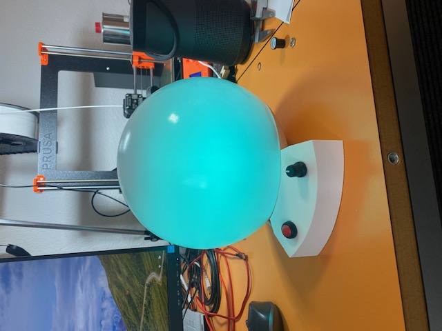
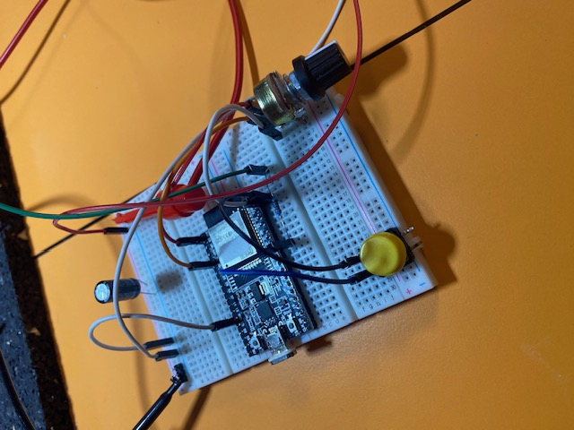
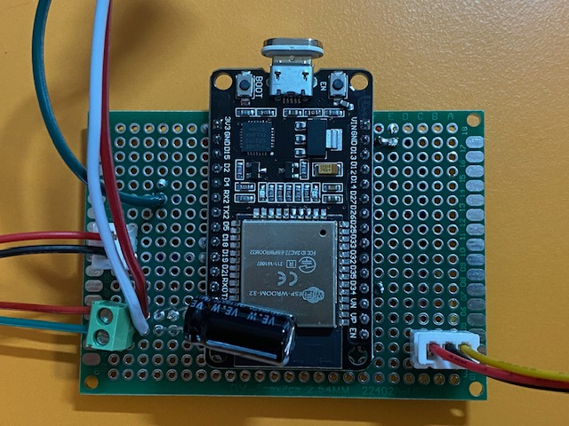
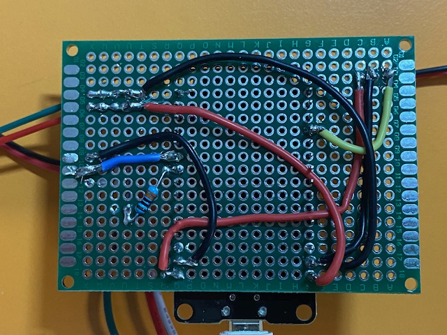
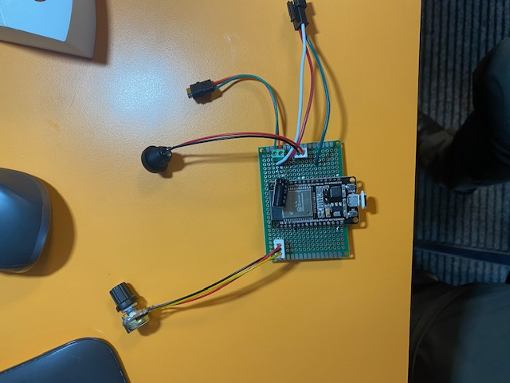
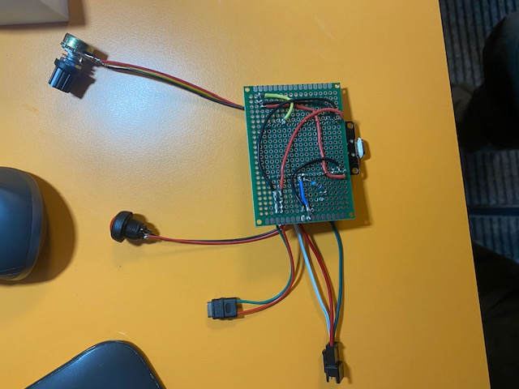
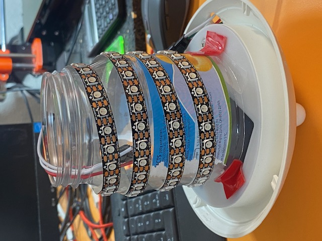
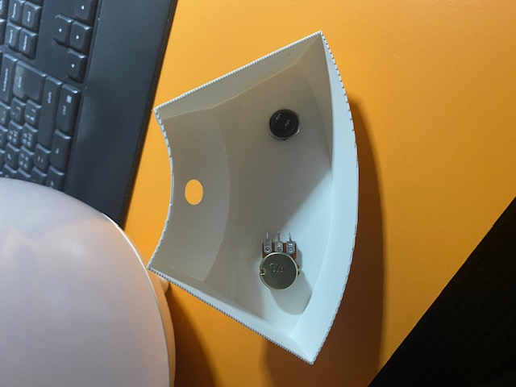

# BG Lamp

A small ESP32-based lamp that changes color according to a Dexcom blood glucose reading.

The project uses:

- an ESP32
- a WS2812B LED strip
- a potentiometer for brightness
- a push button to switch modes
- Dexcom Share / Follow data over Wi-Fi

The lamp can also work as a normal white lamp.

## Features

- reads live Dexcom glucose data over Wi-Fi
- shows glucose level as a smoothly interpolated color
- works internally in **mmol/L**
- white lamp mode
- startup test mode for checking the color mapping
- brightness control with a potentiometer
- very low-light spatial dimming for dark rooms
- button to switch between modes

## Current modes

### StartupTestMode
At power-up, the lamp cycles through test glucose values and shows the corresponding colors.

This makes it easy to tune the color map.

Press the button once to leave test mode.

### BgMode
The lamp color reflects the latest Dexcom glucose value.

### WhiteMode
The lamp acts like a normal white lamp.

## Hardware

Current prototype hardware:

- ESP32 dev board
- WS2812B LED strip, 100 LEDs
- potentiometer
- momentary push button
- 5 V power supply
- 330 ohm resistor in LED data line
- 1000 µF capacitor across LED strip 5 V / GND
- external 3D-printed enclosure for electronics

## Wiring overview

### LED strip
- ESP32 GPIO 18 -> 330 ohm resistor -> LED DIN
- 5 V supply -> LED strip 5 V
- GND supply -> LED strip GND
- ESP32 GND -> common GND

### Potentiometer
- one outer pin -> 3.3 V
- other outer pin -> GND
- middle pin -> GPIO 34

### Push button
- one side -> GPIO 19
- other side -> GND

The button uses the ESP32 internal pull-up.

### Final power wiring
- 5 V supply -> LED strip 5 V
- 5 V supply -> ESP32 VIN / 5V input
- GND supply -> LED strip GND
- GND supply -> ESP32 GND

All grounds must be common.

### Development setup
During development, the ESP32 can be powered from USB while the LED strip is powered separately from a 5 V supply, as long as grounds are connected together.

## Important power note

Do **not** power a long LED strip through thin Dupont wires.

For the LED power path, use short, reasonably thick wires.

Thin wires caused severe voltage drop during development.

## Power supply sizing

For WS2812B LEDs, a common rough worst-case estimate is up to about **60 mA per LED** at full white and full brightness.

For a 100-LED strip, that suggests a theoretical worst case of about:

- **6 A at 5 V**

In real use, the current is often much lower and depends on:

- color
- brightness
- how many LEDs are active

In this project, measured current was approximately:

- **3.6 A** at full white, full brightness

A **5 V / 6 A** supply is therefore a sensible choice for the final build.

## Software / toolchain

This project is built with:

- Visual Studio Code
- PlatformIO
- Arduino framework for ESP32

## Libraries

Main external libraries:

- FastLED
- ArduinoJson

The Dexcom code is based on a patched local copy of `Dexcom_Follow`, because the original version needed fixes to work with the current Dexcom Share login flow.

## Dexcom follower code

The Dexcom code in this project is based on a patched local copy of:

`https://github.com/Hynesman/Dexcom_Follow`

The locally used files are:

- `lib/Dexcom_Follow/Dexcom_follow.h`
- `lib/Dexcom_Follow/Dexcom_follow.cpp`

The original library needed a few fixes to work with the current Dexcom Share login flow.

## Dexcom note

This project uses Dexcom Share / Follow style access and is a hobby project.

It is **not** a medical device.

Do not use this lamp for treatment decisions.

## Current behavior

- glucose values are fetched periodically over Wi-Fi
- the current value is stored in mmol/L
- color is determined by interpolation between anchor colors
- values below the minimum anchor clamp to the first color
- values above the maximum anchor clamp to the last color

## Brightness behavior

Normal global dimming caused strong color distortion at very low brightness.

To improve this, the lamp uses two dimming strategies:

### Spatial dimming
At very low brightness:
- only some LEDs are turned on
- active LEDs are distributed as evenly as possible
- active LEDs use a minimum brightness high enough to preserve color better

### Normal brightness scaling
At higher brightness:
- all LEDs are on
- brightness is increased normally

## Color mapping

The color map is defined as anchor points in mmol/L with RGB values.

Intermediate values are interpolated linearly.

This makes it easy to tune the visual behavior by editing the lookup table.

## File structure

Typical project structure:

- `src/main.cpp` — main application
- `lib/Dexcom_Follow/` — patched Dexcom follower code
- `include/secrets.h` — local Wi-Fi and Dexcom credentials, not committed to Git
- `platformio.ini` — PlatformIO project configuration

## Secrets

Create a local file:

`include/secrets.h`

with this content:

    #pragma once

    constexpr const char* WIFI_SSID = "your_wifi";
    constexpr const char* WIFI_PASS = "your_wifi_password";

    constexpr const char* DEXCOM_USER = "your_dexcom_username";
    constexpr const char* DEXCOM_PASS = "your_dexcom_password";

Make sure this file stays in `.gitignore`.

## Build and upload

Typical Git workflow:

- `git status`
- `git add .`
- `git commit -m "Describe changes"`
- `git push`

In PlatformIO:

- Build
- Upload
- Monitor

## Known future improvements

- add optional LCD display (if wanted)
- smarter polling based on Dexcom timestamps
- stale-data indication
- alarm behavior for dangerous lows
- further tuning of the color map
- cleanup and modularization
- improve comments and documentation
- possibly submit Dexcom fixes upstream
- optimize the update of the LED colors to only when actually needed, not mindlessly every 20 ms

## Disclaimer

This is a personal DIY project.

It is intended as an ambient visual indicator only.

Always rely on the official Dexcom app/device and proper medical guidance for real diabetes management.

## Prototype photos

### Lamp

### Electronics / protoboard

### LEDs inside the diffusor

### Enclosure

